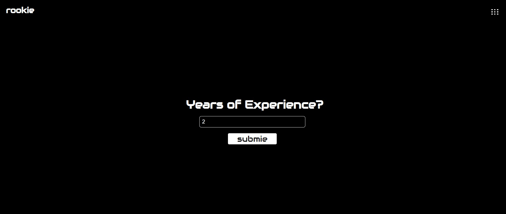
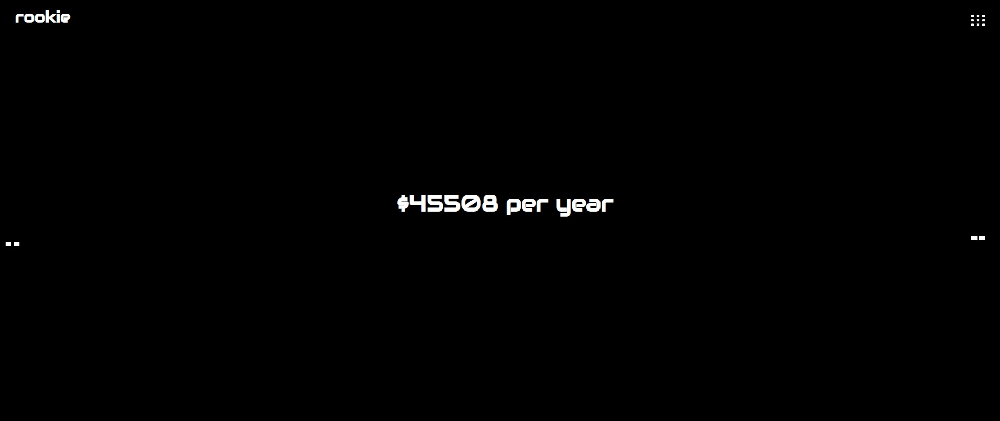

## [rookie](https://futuresalary2app.herokuapp.com/) 

# INTRODUCTION

***rookie*** is a machine learning web application that seeks to help new software engineers make more informed decisions. At this early stage, it uses a machine learning algorithm, simple linear regression, to predict the income of an individual based on that individual's years of experience.

# PURPOSE

There are various resources that teach Software Engineers how to better their skills, from programming challenges to understanding complex Computer Science principles like Time and Space Complexity, Data Structures and Algorithms etc. But the question is, after knowing all these concepts and honing one's skills, what is next? How informed are we about other aspects like income, the types of sectors to work in, companies with good onboarding process etc. These types of information take to much mining to find.

 

And this is the purpose of ***rookie*** to provide newbie Software Engineers with valuable resources and information to make better informed choices as they make their way in these unsteady waters of Software Engineering.

# Tools

The site was built using Python and the Flask Framework. The model for predicting salaries was built on Google Colab then a yaml file was created then added to the backend of the site. The form input captures the user's data, which is then processed by the model and then a figure is outputted back to the client. The figure below shows a flow chart further simplying the overall process of how ***rookie*** predicts Software Engineering salaries based on your years of experience.

# Contributing to rookie

At this present stage, ***rookie*** accepts closed submissions and contributions. Later down the line, ***rookie*** would be become fully open source and accept open contributions. I am always open to suggestions and contributions; if you have any, please reach me here: laresamdeola@gmail.com.

# Live Site

You can visit ***rookie*** [here](https://futuresalary2app.herokuapp.com/)
